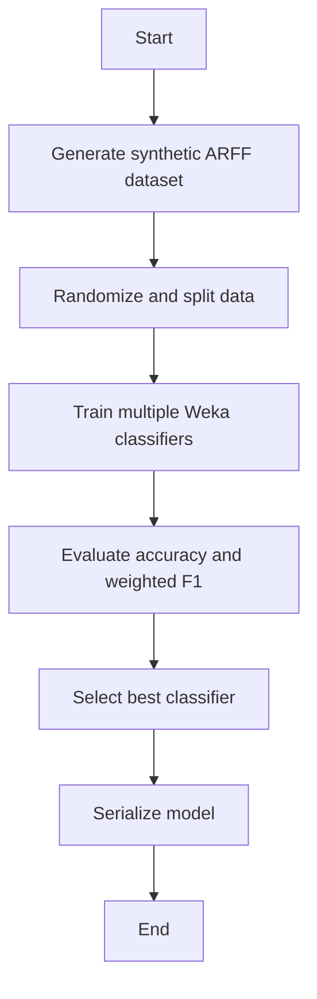
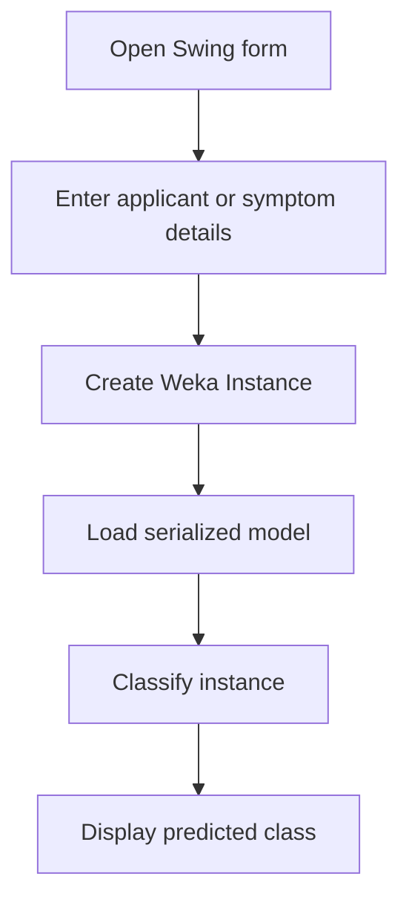

# Flowcharts

## Training and evaluation

```mermaid
flowchart TD
 A[Start] --> B[Generate synthetic ARFF dataset]
 B --> C[Randomize and split data]
 C --> D[Train multiple Weka classifiers]
 D --> E[Evaluate accuracy and weighted F1]
 E --> F[Select best classifier]
 F --> G[Serialize model]
 G --> H[End]
```

## Prediction

```mermaid
flowchart TD
 A[Open Swing form] --> B[Enter applicant or symptom details]
 B --> C[Create Weka Instance]
 C --> D[Load serialized model]
 D --> E[Classify instance]
 E --> F[Display predicted class]
```
